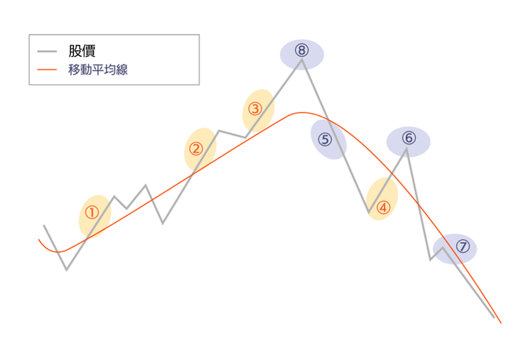

Hi all, 這是個深度學習小白想玩玩 Learning 的一個 Side Project，目標是預測股勢，告訴我什麼時候可以進/退場。

但在實作之前啊，必須補齊一下股票這方面的 Domain know how，不求精通只求夠用，這篇文章主要會用來記錄這些 domain knowledge。
`註記： 這次的code 主體是由 Chat GPT 撰寫，小弟的部分只有提供想法，並基於回應再提出問題，最後將產出的code進行參數的調整`

<!--more-->
# 葛蘭碧法則, J.Granville Rules

簡單來說，是個交易訊號，一個告知我們什麼時候該進退場的訊號



紅線：移動平均線　黑線：股價走勢
## 【買進訊號】：

買進訊號條件

1.突破當移動平均線從下降趨勢逐漸轉為水平盤整或上昇時，且股價從移動平均線下方突破移動平均線，可視為買進訊號。

2.假跌破股價往下跌破移動平均線，但隨即又回到移動平均線之上，且此時移動平均線依然呈現上升趨勢，可視為買進訊號。

3.支撐當股價趨勢走在移動平均線之上，雖然股價修正下跌但並未跌破移動平均線便再度反彈走高，可視為買進訊號。

4.抄底當股價向下急跌，不僅跌破移動平均線，甚至遠遠偏離至移動平均線下方深處，而股價開始反彈上升又趨向移動平均線時，可視為買進訊號。

## 【賣出訊號】：

賣出訊號條件

5.跌破當移動平均線從上升趨勢轉變成水平線或呈現下跌時，且股價從移動平均線上方跌破移動平均線時，可視為賣出訊號。

6.假突破當股價反彈突破移動平均線後，卻又隨即下跌跌破移動平均線，且此時移動平均線依然呈現下降趨勢，可視為賣出訊號。

7.反壓當股價走勢持續走在移動平均線之下，即使股價反彈也無法突破移動平均線，這時移動平均線成為股價的反壓，可視為賣出訊號。

8.反轉當股價向上急漲，且遠遠偏離移動平均線上方極遠之後，股價反轉下跌使得股價趨向移動平均線時，可視為賣出訊號。

# 關鍵點

1. 趨勢判斷
    - 上漲趨勢中,股價高於上升移動平均線,不宜做空
    - 下跌趨勢中,股價低於下降移動平均線,不宜做多
2. 移動平均線作為支撐/阻力
    - 移動平均線本身具有趨勢線的屬性
    - 可作為潛在的支撐或阻力位
3. 趨勢反轉訊號
    - 關注股價在均線上下的多頭/空頭排列模式
    - 一旦排列方向反轉,視為潛在的反向入場時機
4. 均線交叉訊號
    - 均線黃金交叉(短期穿越長期上方)可能引發上漲趨勢
    - 均線死亡交叉(短期穿越長期下方)可能引發下跌趨勢
    - 交叉點附近可尋找順勢入場時機均#線的種類

# **均線的種類**

均線大概可以分成三種，計算方式不同，靈敏度也不一樣：

- **SMA（簡單移動平均線）**
    
    這是最常見、也是計算最簡單的均線。通常報價軟體預設的均線就是這種。它的計算方式是把選定區間內的數值全部加起來，然後除以總天數。也就是說，每天的價格權重都一樣。
    
- **EMA（指數移動平均線）**
    
    EMA給最近的價格更高的權重，反應比較快。它的計算方法是，越近期的價格權重越高，依照指數方式往前遞減，所以比SMA更靈敏。

每種均線都有其特定的應用情境，而我們在找葛蘭碧突破的股票時，我們只需要用到SMA就好，所以後面我們所提到的均線都是指SMA。

-----
# Python 實作

依賴 Library: FinMind

```python=
from FinMind.data import DataLoader 

stock_no = '006208'
dl = DataLoader()
stock_data = dl.taiwan_stock_daily(
    stock_id=stock_no, 
    start_date='2024-08-25',
    end_date='2024-09-30')
stock_data['MA_50'] = stock_data['close'].rolling(windows=50).mean()
```

## 找出 買入訊號，賣出訊號
### SMA
```python=
df = stock_data

# calculate ma
def calculate_ma(data, window):
    return data.rolling(window=window).mean()
ma_window = 60
df[f'MA_{ma_window}'] = df['close'].rolling(window=ma_window).mean()
print(df[[f'MA_{ma_window}', 'close']].tail())

# calculate when should be buy or sell
df['is_buy_signal'] = (df['close'].shift(1) < df[f'MA_{ma_window}'].shift(1)) & (df['close'] > df[f'MA_{ma_window}']) 
df['is_sell_signal'] = (df['close'].shift(1) > df[f'MA_{ma_window}'].shift(1)) & (df['close'] < df[f'MA_{ma_window}']) 
buy_dates = df[df['is_buy_signal']][['date', f'MA_{ma_window}', 'close']]
sell_dates = df[df['is_sell_signal']][['date', f'MA_{ma_window}', 'close']]

# output result
print("買入信號日期：")
print(f'{buy_dates.tail()}')
print("\n賣出信號日期：")
print(f'{sell_dates.tail()}')
```

### EMA
```python
df = pd.read_csv('stock_data.csv')
# calculate ema
ema_window = 60 
df[f'EMA_{ema_window}'] = df['close'].ewm(span=ema_window).mean()
print(df[[f'EMA_{ema_window}', 'close']].tail())

# calculate when should be buy or sell
df['is_buy_signal_ema'] = (df['close'].shift(1) < df[f'EMA_{ema_window}'].shift(1)) & (df['close'] > df[f'EMA_{ema_window}'])
df['is_sell_signal_ema'] = (df['close'].shift(1) > df[f'EMA_{ema_window}'].shift(1)) & (df['close'] < df[f'EMA_{ema_window}'])

# output result
print(f'買入信號日期：\n{df[df["is_buy_signal_ema"]][["date", f"EMA_{ema_window}", "close"]].tail()}')
print(f'賣出信號日期：\n{df[df["is_sell_signal_ema"]][["date", f"EMA_{ema_window}", "close"]].tail()}')
```

### 打包成 csv檔
```python 
data = pd.DataFrame()
data["Close"] = df['close']
data["EMA"] = df['close'].ewm(span=60).mean()
data["SMA"] = df['close'].rolling(window=60).mean()
data["date"] = df['date']

features = ["Close", "EMA", "SMA", "date"]
data = data.dropna()
data.to_csv('data.csv', index=False)
```

# Conclusion
這篇文章主要是透過以往的資料，來判定說在之前的情況什麼時候該買/賣，並在最後將計算得出的 MA, EMA 及實際收盤價打包成 `data.csv`。
這篇就先這樣，之後就可以來 train 個 model 預測收盤價囉。